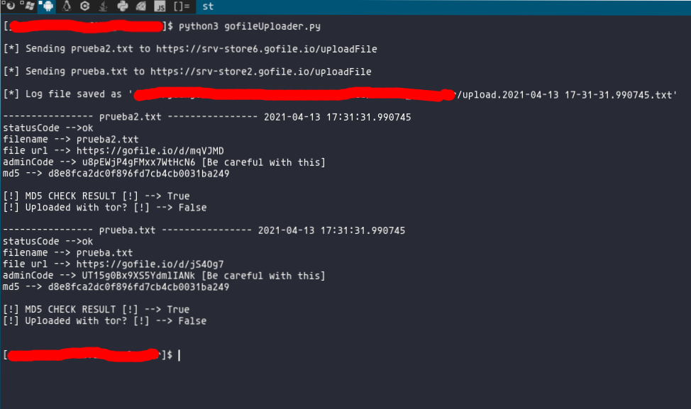

# gofile.io_uploader

Upload your files to [gofile.io](https://gofile.io) automatically with this Python script!. 

## Table of contents
* [General info](#general-info)
* [Changelog](#changelog)
* [Checksums](#checksums)
* [Capabilities](#capabilities)
* [Setup](#setup)
* [Examples](#Examples)
* [Features to add](#Features-to-add)

## General info

>- Upload your files to [gofile.io](https://gofile.io) easily. (This script is supposed to work on windows, but it hasn't been tested) 

## Changelog

>New release "0.0.2".

>- Now you can delete files from gofile.io
>- Errors with socks fixed
>- Shorter and cleaner code! 

## Capabilities

>- Upload files using the best gofile server, even with tor
>- Uploads are logged in the runtime folder
>- Delete any file on the cloud
>- User-agent spoofed
>- MD5 check between local and cloud files

## Checksums

gofileUploader.py hashes

>Md5 --> `afe46b2dbc8c31bf1cd941525dcb4610`

>Sha1 --> `4feec6c091adb927d974d2ed68e7e9a58cd41e25`

>Sha256 --> `3f215ceab3b150f5804a4f91ddb4156e48227e8aec33059e1eb239bd90a47aee`

>Sha512 --> `8d6534f65f5df72574247fc669dd204b319beb287c1d2fdca0c72cd2cc24db3ceca829bcbed7edf9699ec10fee998d626adc6d993dc69526afb50addbe2d1a7b`

## Setup

***Install requirements***

`$ pip3 install -r requirements.txt`

Then move your files into "uploads/" directory.

## Examples

***For basic info:***

`$ python3 gofile_uploader.py` (Upload your files using YOUR ACTUAL IP)

`$ python3 gofile_uploader.py -t` (Upload your files using TOR. You must have tor running on 127.0.0.1:9050)

`$ python3 gofile_uploader.py (-t) -d -u "https://gofile.io/d/Udmxxx"`-a "V2CiusxxQxxxxxxxxxxx"

`$ python3 gofile_uploader.py (--tor) --delete --url "https://gofile.io/d/Udmxxx"`--adminCode "V2CiusxxQxxxxxxxxxxx"

## Features to add

- Include native tor binaries
- Add custom proxy capability
