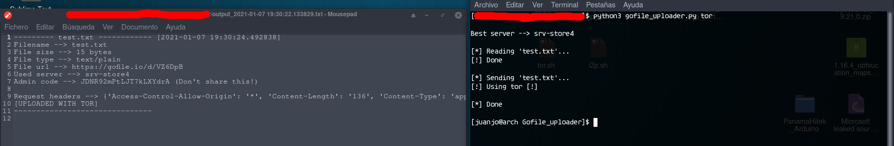

# gofile.io_uploader
Upload your files to [gofile.io](https://gofile.io) easily with this Python script!. 

## Table of contents
* [General info](#general-info)
* [Checksums](#checksums)
* [Capabilities](#capabilities)
* [Setup](#setup)
* [Examples](#Examples)
* [Features to add](#Features-to-add)

## General info
>Upload your files to [gofile.io](https://gofile.io) easily. (This script is supposed to work on windows, but it hasn't been tested)

## Capabilities

>- Posibility of uploading files using tor
>- User-agent spoofed

## Checksums
gofile_uploader.py hashes

>Md5 --> `9c7011c2978b8769ca70751f5b84e65b`

>Sha1 --> `6F2C31EA21EE74603BBAD17F4CDA7F0CEE1FB2B0`

>Sha256 --> `D501C587A4859AB188E3332CC9F3057870CF3AD9710CF542B8C7E0C5CACE57F1`

>Sha512 --> `24A194F3D324BB3CEB8E86508485211131B5161F540FEE3916113B0746A032B9078E252F79FD85FC8A073503A2352A2CA07F69FE5FC31E6AAC41A910E3961174`

## Setup

***Install requirements***

`$ pip3 install -r requirements.txt`

Then move your files into "files/" directory.

## Examples

***For basic info:***

`$ python3 gofile_uploader.py` (Upload your files using YOUR ACTUAL IP)

`$ python3 gofile_uploader.py tor` (Upload your files using TOR. You must have tor running on 127.0.0.1:9050)

## Features to add

- Upload many files in only one link
- Include tor binaries
